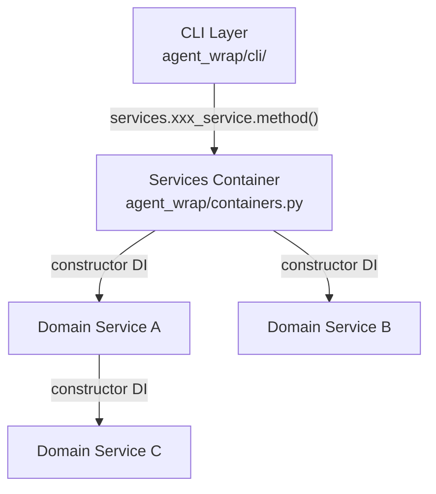

<!-- This file has been created with the assistance of an AI tool. -->
# Architecture

This document describes the project's architecture, layer boundaries, and key design conventions.

## Purpose

A Docker-based wrapper for the Claude Code CLI that isolates the agent in containers, keeps API credentials out of the agent process, and lets each project customize its environment with a `Dockerfile.agent`. It packages Claude Code into a reproducible container image and exposes a single `agent` command. Model traffic is routed through a provider plugin system — all shipped providers use a [LiteLLM](https://github.com/BerriAI/litellm) sidecar. See [Providers](providers.md) for available options.

## Package layout

```
agent_wrap/
├── cli/             # User-facing CLI commands (run, rebuild, create, logs, stats, inspect, cleanup, update, secrets)
├── domain/          # Business logic — one subpackage per concern, each with its own tests/
│   ├── build/       #   Image build orchestration
│   ├── config/      #   Configuration reading
│   ├── create/      #   New agent bootstrap
│   ├── display/     #   Centralized display/output formatting
│   ├── launch/      #   Container launch and lifecycle
│   ├── logs/        #   Log viewing and serving
│   ├── pricing/     #   Token pricing data
│   ├── providers/   #   Provider plugin system + LiteLLM sidecar
│   ├── secrets/     #   Credential management
│   ├── sidecars/    #   Sidecar lifecycle management
│   ├── stats/       #   Usage statistics
│   ├── status/      #   System-state aggregation (the `inspect` command)
│   └── updates/     #   Self-update checks
├── lib/             # Reusable general-purpose utilities — "could be extracted to a standalone library"
├── constants.py     # Module-level constants shared by multiple modules
├── exceptions.py    # ALL custom exceptions
└── containers.py    # DI container — the singleton Services instance
```

## Layered architecture

The layers are strictly separated:



**From outside `agent_wrap/domain/`** (including the CLI), access domain logic ONLY through `services.xxx_service.method()`. Never import from `agent_wrap.domain.xxx.xxx` directly.

## Services container

`agent_wrap/containers.py` defines a `Services` class — a lazy-initialized singleton. Each service is a `@cached_property` that creates its dependencies via constructor injection. Services that are never accessed are never created.

```python
# The singleton instance — the ONLY way external code reaches domain logic:
from agent_wrap.containers import services

services.launch_service.launch(...)
```

Inter-service dependencies are wired through constructors:

```python
@cached_property
def launch_service(self) -> LaunchService:
    return LaunchService(
        config_service=self.config_service,
        secrets_service=self.secrets_service,
        update_service=self.update_service,
        provider_service=self.provider_service,
    )
```

## Domain service structure

Each subpackage under `agent_wrap/domain/` follows this pattern:

```
domain/<name>/
├── __init__.py
├── constants.py     # Module-level constants (optional)
├── models.py        # Data / type-carrying classes (optional)
├── service.py       # Domain service class (e.g., BuildService, LaunchService)
└── tests/            # Unit tests for this service
    ├── __init__.py
    ├── conftest.py   # Service-level fixtures
    └── test_<name>.py
```

## Provider plugin system

Providers live under `agent_wrap/domain/providers/`, each in its own subdirectory with a `README.md` documenting provider-specific env vars, credentials, and model mappings. All providers implement a common interface and route model traffic through a LiteLLM sidecar — one container per provider (`agent-wrap-<provider>`), so agents on different providers run concurrently. The `Provider` ABC is LiteLLM-specific by construction — it implements `sidecar()` itself rather than leaving it abstract, so there is no non-LiteLLM path a subclass could take.

A provider subdirectory is one that holds a `provider.py`; discovery skips any that does not. `litellm_runtime/` is therefore not a provider — see the key convention below.

Providers access sidecar functionality through an injected `SidecarService` (see [agent_wrap/domain/sidecars/service.py](../agent_wrap/domain/sidecars/service.py)). The LiteLLM provider lifecycle is documented in [agent_wrap/domain/providers/README.md](../agent_wrap/domain/providers/README.md).

## Domain-layer architecture rules (non-negotiable)

1. **From outside `agent_wrap/domain/`** → access domain logic ONLY through
   `services.xxx_service.method()`. Never import from `agent_wrap.domain.xxx.xxx`
   directly.
2. **Across service subpackages inside `agent_wrap/domain/`** → constructor DI
   only. Never import functions/classes from another service subpackage at runtime.
   `TYPE_CHECKING`-only imports are fine.
3. **Within the same service subpackage** → direct module-level imports allowed.
4. **No `@staticmethod` on any domain service class.** All service methods must be
   regular instance methods so they are always accessed through the DI instance.
5. **No local imports** (function-body `import` / `from`). The ONLY exception is
   `agent_wrap/containers.py`, which may use local imports inside
   `@cached_property` methods.
6. **All custom exceptions** must be defined in `agent_wrap/exceptions.py`. Every
   consumer imports them directly from there — no class-attribute proxies like
   `SecretsService.SecretNotFoundError`.
7. **Namespace Classes** — standalone functions that share a micro-domain must be
   grouped into a *namespace class*: a class with only ``@staticmethod`` methods,
   no ``__init__``, and no instance state. These replace comment-separated blocks
   (``# --- Topic ---``) as the organizational unit. They are pure organizational
   constructs — distinct from domain *service* classes, which have instance state
   and constructor DI. Private namespace classes use a ``_`` prefix. The
   ``@staticmethod`` decorator on a namespace class does **not** conflict with
   rule 4 (which bans it only on domain service classes).
8. **``models.py``** — every domain subpackage may include an optional
   ``models.py``. All data- or type-carrying classes — dataclasses, TypedDicts,
   NamedTuples, enums, type aliases, and plain data-holding classes (whether
   public or ``_``-prefixed) — must be defined in ``models.py``. Service classes
   and namespace classes do **not** go in ``models.py``.
9. **No pure-proxy service methods.** A method that delegates to another callable
   without adding any logic — no validation, transformation, conditional logic,
   error handling, or logging — is forbidden. This includes methods that only
   inject constructor dependencies before forwarding (e.g.
   ``serve_foreground(self, port): return _serve_foreground(port,
   pricing=self._pricing)``). Inline the target's implementation into the
   service method and remove the original target (no dual implementations).
   Service boundaries stay intact — callers continue through ``services.*``.
10. **``constants.py``** — every domain subpackage may include an optional
    ``constants.py``. All module-level constants — plain variables, regex patterns,
    frozensets, and path-like config values — must be defined here rather than
    scattered across service files or helper modules. This mirrors rule 8
    (``models.py``) but for constant definitions.
11. **``service.py``** — every domain subpackage that defines a domain service class
    must place that class in a file named ``service.py``. Service files must not be
    named after the subpackage (e.g. ``build.py`` for ``BuildService``) or with a
    ``_service`` suffix (e.g. ``provider_service.py``). Each domain subpackage
    defines exactly one service class in its ``service.py``.

## Key conventions

- **Exceptions**: all custom exceptions are defined in `agent_wrap/exceptions.py`. Consumers import directly from there.
- **Constants**: module-level constants imported by more than one module belong in `agent_wrap/constants.py`. Subpackage-scoped constants (public or `_`-prefixed) belong in an optional ``constants.py`` within their domain subpackage (see rule 10).
- **``__init__.py``**: must not re-export names from sibling modules. Every consumer imports directly from the module that defines the name.
- **Private names**: never import a private (`_`-prefixed) name from another module. If a name is intended for import outside its defining module, it must be public (no underscore).
- **Namespace classes**: comment-separated blocks of standalone functions that share a micro-domain must be replaced with a namespace class — a class whose methods are all ``@staticmethod`` and that has no instance state (see rule 7). They are pure organizational containers; do not confuse them with domain service classes.
- **``models.py``**: data- and type-carrying classes (dataclasses, TypedDicts, enums, type aliases) belong in an optional ``models.py`` within their domain subpackage (see rule 8).
- **``constants.py``**: module-level constants (whether public or ``_``-prefixed) belong in an optional ``constants.py`` within their domain subpackage, neighboring ``models.py`` (see rule 10).
- **``service.py``**: every domain service class must be defined in ``service.py`` — not after the subpackage and not with a ``_service`` suffix (see rule 11).
- **`lib/` boundary**: modules in `lib/` must be general-purpose — "could be extracted to a standalone library." Domain-specific logic (agent-wrap concepts, LLM tokens, Docker image naming conventions) belongs in `domain/` or `cli/`. Conversely, general-purpose code (data structures, concurrency primitives, terminal rendering) should move to `lib/` rather than masquerading as domain-specific.
- **`providers/litellm_runtime/`**: a plain directory (no `__init__.py`) of Python files mounted into the LiteLLM sidecar container. It is not a Python package — files within it use `sys.path` manipulation for intra-directory imports. Shared types consumed by external code (`LogRecord`, `MetaData`) live in `providers/models.py`.
- **NamedTuple for 3+ element tuple returns**: any function or method whose return type is a `tuple` with three or more type arguments must use a properly typed `NamedTuple` (defined in the appropriate `models.py`) instead of a bare `tuple[...]`. This applies equally to module-level tuple type aliases used as return types. Two-element tuples are exempt.

## Anti-patterns (explicitly forbidden)

These patterns circumvent the domain-layer boundaries and must never be used.

### Module-level sentinel injection

```python
# FORBIDDEN:
_sentinel: Callable = lambda *a, **kw: (_ for _ in ()).throw(RuntimeError("not injected"))


def inject_deps(fn):  # mutates module-level globals at startup
    global _sentinel
    _sentinel = fn
```

**Why it's wrong**: This is global mutable state passed off as dependency injection.
It defeats static analysis, creates hidden coupling between modules, and the
sentinel is untestable without mutating globals first. Rule 2 requires constructor
DI through services — module-level globals are not constructor DI.

**Correct approach**: The function that needs cross-domain access must be a method
on a domain service class that holds the dependency via ``__init__``. The service
instance — wired by ``containers.py`` — carries the dependency, and the method
accesses it through ``self``.

### Service class-attribute re-exports

```python
# FORBIDDEN:
from somewhere import SomeType


class SomeService:
    SomeType = SomeType  # aliasing an imported type as a class attribute
```

**Why it's wrong**: This is the same category of re-export that the ``__init__.py``
convention already forbids for packages — it creates an alias that lets consumers
bypass importing from the defining module. When a consumer holds a service
instance, that instance should provide *behaviour* (methods), not re-export types.
A factory method (e.g. ``new_thing() -> SomeType``) is the proper alternative:
it is behaviour, not a type alias.

### Injecting an unrelated service for a trivial utility

```python
# FORBIDDEN:
class ConfigService:
    def __init__(self, build_service: BuildService):  # only needed project_path_hash
        ...
```

**Why it's wrong**: This couples unrelated domains and bloats ``__init__``
signatures for functions that are not the injected service's responsibility.
If the function is general-purpose, it belongs in ``lib/``. If it is
domain-specific but doesn't match the injected service's domain, the
functionality may need its own service boundary.

### Duplicating a model class across domains

```python
# FORBIDDEN — in stats/models.py:
class Bucket:  # identical copy of pricing/models.py:Bucket
    ...
```

**Why it's wrong**: Duplicate definitions drift, violate DRY, and paper over a
missing service boundary. The canonical definition belongs in the owning domain's
``models.py``. Other domains access the type through that domain's service —
``TYPE_CHECKING`` imports for annotations, and factory methods on the service
for construction.
