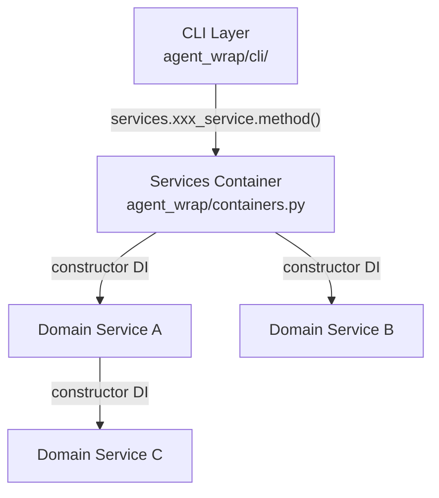

<!-- This file has been edited with the assistance of an AI tool. -->
# Architecture

This document describes the project's architecture, layer boundaries, and key design conventions.

## Purpose

A Docker-based wrapper for the Claude Code CLI that isolates the agent in containers, keeps API credentials out of the agent process, and lets each project customize its environment with a `.claude-agent-wrap/Dockerfile`. It packages Claude Code into a reproducible container image and exposes a single `agent` command. Model traffic is routed through a provider plugin system — all shipped providers use a [LiteLLM](https://github.com/BerriAI/litellm) sidecar. See [Providers](providers.md) for available options.

## Package layout

```
agent_wrap/
├── cli/             # User-facing CLI commands (run, rebuild, create, logs, stats, inspect, cleanup, update, secrets)
├── domain/          # Business logic — one subpackage per concern, each with its own tests/
│   ├── build/       #   Image build orchestration
│   ├── config/      #   Configuration reading
│   ├── create/      #   New agent bootstrap
│   ├── display/     #   Centralized display/output formatting
│   ├── launch/      #   Container launch and lifecycle
│   ├── logs/        #   Log viewing and serving
│   ├── pricing/     #   Token pricing data
│   ├── providers/   #   Provider plugin system + LiteLLM sidecar
│   ├── secrets/     #   Credential management
│   ├── sidecars/    #   Sidecar lifecycle management
│   ├── stats/       #   Usage statistics
│   ├── status/      #   System-state aggregation (the `inspect` command)
│   └── updates/     #   Self-update checks
├── lib/             # Reusable general-purpose utilities — "could be extracted to a standalone library"
├── constants.py     # Module-level constants shared by multiple modules
├── exceptions.py    # ALL custom exceptions
└── containers.py    # DI container — the singleton Services instance
```

## Layered architecture

The layers are strictly separated:



**From outside `agent_wrap/domain/`** (including the CLI), access domain logic ONLY through `services.xxx_service.method()`. Never import from `agent_wrap.domain.xxx.xxx` directly.

## Services container

`agent_wrap/containers.py` defines a `Services` class — a lazy-initialized singleton. Each service is a `@cached_property` that creates its dependencies via constructor injection. Services that are never accessed are never created.

```python
# The singleton instance — the ONLY way external code reaches domain logic:
from agent_wrap.containers import services

services.launch_service.launch(...)
```

Inter-service dependencies are wired through constructors:

```python
@cached_property
def launch_service(self) -> LaunchService:
    return LaunchService(
        config_service=self.config_service,
        secrets_service=self.secrets_service,
        update_service=self.update_service,
        provider_service=self.provider_service,
    )
```

## Domain service structure

Each subpackage under `agent_wrap/domain/` follows this pattern:

```
domain/<name>/
├── __init__.py
├── constants.py     # Module-level constants (optional)
├── models.py        # Data / type-carrying classes (optional)
├── service.py       # Domain service class (e.g., BuildService, LaunchService)
└── tests/            # Unit tests for this service
    ├── __init__.py
    └── test_<name>.py
```

## Provider plugin system

Providers live under `agent_wrap/domain/providers/`, each in its own subdirectory with a `README.md` documenting provider-specific env vars, credentials, and model mappings. All providers implement a common interface and route model traffic through a LiteLLM sidecar — one container per provider (`agent-wrap-<provider>`), so agents on different providers run concurrently. The `Provider` ABC is LiteLLM-specific by construction — it implements `sidecar()` itself rather than leaving it abstract, so there is no non-LiteLLM path a subclass could take.

A provider subdirectory is one that holds a `provider.py`; discovery skips any that does not. `litellm_runtime/` is therefore not a provider — see the key convention below.

Providers access sidecar functionality through an injected `SidecarService` (see [agent_wrap/domain/sidecars/service.py](../agent_wrap/domain/sidecars/service.py)). The LiteLLM provider lifecycle is documented in [agent_wrap/domain/providers/README.md](../agent_wrap/domain/providers/README.md).

## Domain-layer architecture rules (non-negotiable)

1. **From outside `agent_wrap/domain/`** → access domain logic ONLY through
   `services.xxx_service.method()`. Never import from `agent_wrap.domain.xxx.xxx`
   directly.
2. **Across service subpackages inside `agent_wrap/domain/`** → constructor DI
   only. Never import functions/classes from another service subpackage at runtime.
   `TYPE_CHECKING`-only imports are fine.
3. **Within the same service subpackage** → direct module-level imports allowed.
4. **No `@staticmethod` on any domain service class.** All service methods must be
   regular instance methods so they are always accessed through the DI instance.
5. **No local imports** (function-body `import` / `from`). The ONLY exception is
   `agent_wrap/containers.py`, which may use local imports inside
   `@cached_property` methods.
6. **All custom exceptions** must be defined in `agent_wrap/exceptions.py`. Every
   consumer imports them directly from there — no class-attribute proxies like
   `SecretsService.SecretNotFoundError`.
7. **Namespace Classes** — standalone functions that share a micro-domain must be
   grouped into a *namespace class*: a class with only ``@staticmethod`` methods,
   no ``__init__``, and no instance state. These replace comment-separated blocks
   (``# --- Topic ---``) as the organizational unit. They are pure organizational
   constructs — distinct from domain *service* classes, which have instance state
   and constructor DI. Private namespace classes use a ``_`` prefix. The
   ``@staticmethod`` decorator on a namespace class does **not** conflict with
   rule 4 (which bans it only on domain service classes).
8. **``models.py``** — every domain subpackage may include an optional
   ``models.py``. All data- or type-carrying classes — dataclasses, TypedDicts,
   NamedTuples, type aliases, and plain data-holding classes (whether public or
   ``_``-prefixed) — must be defined in ``models.py``. Service classes and
   namespace classes do **not** go in ``models.py``. Enums belong in
   ``constants.py`` instead (rule 10) — a fixed set of named values, not a
   data-carrying type.
9. **No pure-proxy service methods.** A method that delegates to another callable
   without adding any logic — no validation, transformation, conditional logic,
   error handling, or logging — is forbidden. This includes methods that only
   inject constructor dependencies before forwarding (e.g.
   ``serve_foreground(self, port): return _serve_foreground(port,
   pricing=self._pricing)``). Inline the target's implementation into the
   service method and remove the original target (no dual implementations).
   Service boundaries stay intact — callers continue through ``services.*``.

   **Named exceptions** — these forward deliberately and must not be "fixed":

   * factory methods (``SidecarService.create_tracker`` and its siblings) — constructing a collaborator *is* the behaviour;
   * ``DisplayService.spin_while`` / ``poll_until`` — the ``Spinner`` collaborator owns the animation loop and stays a separate class;
   * ``SidecarService.telegram_required_secrets`` — the secret list belongs to ``TelegramSidecar``, which declares it.
10. **``constants.py``** — every domain subpackage may include an optional
    ``constants.py``. All module-level constants — plain variables, regex patterns,
    frozensets, path-like config values, and enums — must be defined here rather
    than scattered across service files or helper modules. This mirrors rule 8
    (``models.py``) but for constant definitions. This scope includes the package
    root: ``agent_wrap/models.py`` / ``agent_wrap/constants.py`` follow the same
    split as a domain subpackage's pair.
11. **``service.py``** — every domain subpackage that defines a domain service class
    must place that class in a file named ``service.py``. Service files must not be
    named after the subpackage (e.g. ``build.py`` for ``BuildService``) or with a
    ``_service`` suffix (e.g. ``provider_service.py``). Each domain subpackage
    defines exactly one service class in its ``service.py``.
12. **No ``from __future__ import annotations``.** PEP 649 defers annotation
    evaluation natively on the pinned interpreter, so the future import buys
    nothing and actively downgrades annotations back to plain strings. The sole
    exception is ``providers/litellm_runtime/``, which runs on the LiteLLM image's
    older Python and still needs it to keep ``TYPE_CHECKING`` imports out of
    runtime annotations — the same carve-out rule 3 (EC001) draws.

## The interpreter, and the dependency policy

`bin/agent-bootstrap` provisions a pinned CPython into `.python/` (version and
per-platform SHA-256 in `python-pin.env`) and, on top of it, a venv holding the locked
third-party dependencies. `bin/agent` execs *the venv*. There is deliberately no fallback
to the host's `python3`: a fallback would be a floor in disguise, and the point of owning
the interpreter is that the oldest distro anyone runs no longer decides what this code may
use.

**`bin/agent` provisions on demand.** When the venv pointer names nothing runnable — a first
run, or a checkout that moved — the launcher runs the bootstrap itself rather than exiting
with instructions, then re-reads the pointer and execs. The bootstrap is non-interactive,
idempotent and lock-serialised, so there is no decision to hand back to a human; it is the
same reasoning behind `UpdateService._reprovision_interpreter`, which runs it unconditionally
after a HEAD-advancing update. Two deliberate carve-outs: the launcher calls the *plain*
bootstrap, never `--dev` (`--dev` needs `uv`, and this is the end-user path), and it skips
provisioning entirely under `AGENT_COMPLETE`, because `agent-wrap.bashrc` discards the
completion subshell's stderr and exit code and would offer any stdout as a candidate. The
bootstrap's progress is redirected to stderr so a verb's stdout stays clean for whatever is
parsing it — and that progress is deliberately loud: the bootstrap names the target and
venv it resolved, says why it decided to do work (or that it had none), traces every
external command it runs, and leaves each one's own output unmuted, so provisioning is
watchable instead of a silent pause on a 34MB download. `scripts/test_agent_launcher.py` covers all of this against a stub bootstrap. `requires-python` pins that exact version, and `make python-check` fails when the two
files disagree or when the running interpreter is not the pinned one.

**Dependencies are declared once and pinned twice.** `[project].dependencies` holds
first-degree requirements as `x>=y` ranges; `uv.lock` resolves them; `bin/requirements.txt`
is the hash-pinned export the bootstrap actually installs, regenerated by
`make dump-prod-constraints` and guarded by `make constraints-check`. `[tool.uv]` sets
`exclude-newer = "7 days"`, so a release has to survive a week on PyPI before this project
will resolve to it. pip installs the export under `--require-hashes`, which makes the
hashes a hard gate rather than decoration — the same posture as the interpreter tarball's
SHA-256 check. `uv` is a developer and CI tool only; the end-user path needs pip and PyPI,
nothing more.

**Declared requirements are floors, and a floor is an output.** No requirement here carries
an upper bound — the lock pins, and the cooldown is what holds back a release that is too
new, so a cap would only hide majors from the upgrade path. That path is two targets:
`make available-upgrades` re-resolves with `--dry-run` and reports what could move without
writing anything, and `make upgrade-deps` performs it, pipes `uv tree` through
`scripts/sync-dependencies.py` to rewrite each `>=` in `pyproject.toml` to the version just
locked, re-locks so `uv.lock`'s recorded requirements match, and re-exports the constraints.
So the floors state what was last resolved rather than a hand-chosen minimum, and the three
artifacts move as one unit.

**The venv the CLI runs on is content-addressed and never mutated.** Its directory name
embeds the interpreter pin, the target triple, and the first 12 hex of the SHA-256 of the
constraints it was built from. A dependency change therefore publishes a *new* directory
and moves the one-line `current-venv` pointer with a single atomic rename; the previous
venv stays on disk and keeps working for anything still running on it. A failed install
never moves the pointer, so the CLI falls back to the old dependency set rather than to
none.

**The project itself is still never installed.** The bootstrap installs the constraints
alone and `[tool.uv] package = false` keeps `uv sync` from installing `agent_wrap` either,
so nothing can shadow the source `PYTHONPATH` provides.

**Dev tooling is one flag, not a second step.** `make install` is
`bin/agent-bootstrap --dev`, which skips the pip half entirely and hands the whole
dependency question to `uv sync --locked` — prod dependencies and the `dev` group
together, out of the lock the constraints were exported from. Docs, CI and
`.claude-agent-wrap/Dockerfile` all say `make install` and nothing else. Without the flag
the bootstrap builds exactly the runtime the shipped CLI needs and requires no `uv` at
all, so an end user never pays for pytest, ruff or pyrefly.

**The `--dev` venv is the one exception to the paragraph above.** It is named
`venv-<ver>+<rel>-<target>-dev` — the interpreter alone, no content hash — and is synced
in place rather than republished. A hash would gate nothing there: `uv sync` reconciles
the venv against `uv.lock` on every run, which is also what catches a dev-group bump that
left `bin/requirements.txt` untouched. The atomic-swap guarantee is for the venvs `agent`
itself execs, and nothing on that path passes `--dev` — `agent update` re-provisions with
the plain bootstrap. The one consequence upward is that `agent inspect` cannot judge such
a venv against the constraints file, so it reports nothing rather than guessing
(`_deps_current` in `domain/status/service.py`).

**Two regions do not run on the pinned interpreter** and must stay inside a lower floor.
They also have no access to the venv above, so they stay **stdlib-only permanently** —
neither has a mechanism by which a third-party package could be installed for it:

| Region | Runs on | Floor |
| --- | --- | --- |
| `ops/statusline.py` | the agent container's `python3` | 3.12 |
| `agent_wrap/domain/providers/litellm_runtime/` | the pinned LiteLLM image's Python | 3.13 |

Both floors are the versions actually running, read off the images rather than
guessed — the `Makefile` records the two commands next to the constants. Read the
*running process*, not `python3 -V`: `PATH` can resolve to a different interpreter
than the one hosting the code, which is exactly the case in the LiteLLM image
(a venv shim in front of `/usr/bin/python3.13`), so only `/proc/1/exe` settles it.

`make carveout-check` enforces those floors with three legs, all of which have caught
something: `ruff check` for version-gated syntax, `pyrefly` for stdlib APIs that do not
exist yet on the floor (`datetime.UTC`), and `ruff format` — because at `py314` the
*formatter* strips the parentheses from `except (A, B):`, which is a `SyntaxError` on
older interpreters. Those files are excluded from the default format pass for that reason
and are formatted at their own target instead. Each region is checked at its own floor,
so the two never have to share the more conservative number.

## Key conventions

- **Exceptions**: all custom exceptions are defined in `agent_wrap/exceptions.py`. Consumers import directly from there.
- **Constants**: module-level constants imported by more than one module belong in `agent_wrap/constants.py`. Subpackage-scoped constants (public or `_`-prefixed) belong in an optional ``constants.py`` within their domain subpackage (see rule 10).
- **``__init__.py``**: must not re-export names from sibling modules. Every consumer imports directly from the module that defines the name.
- **Private names**: never import a private (`_`-prefixed) name from another module. If a name is intended for import outside its defining module, it must be public (no underscore).
- **Namespace classes**: comment-separated blocks of standalone functions that share a micro-domain must be replaced with a namespace class — a class whose methods are all ``@staticmethod`` and that has no instance state (see rule 7). They are pure organizational containers; do not confuse them with domain service classes.
- **``models.py``**: data- and type-carrying classes (dataclasses, TypedDicts, NamedTuples, type aliases) belong in an optional ``models.py`` within their domain subpackage (see rule 8).
- **``constants.py``**: module-level constants (whether public or ``_``-prefixed), including enums, belong in an optional ``constants.py`` within their domain subpackage, neighboring ``models.py`` (see rule 10).
- **``service.py``**: every domain service class must be defined in ``service.py`` — not after the subpackage and not with a ``_service`` suffix (see rule 11).
- **Image build stamps**: agent images carry their provenance as docker *build* labels
  (`--label`), not `LABEL` instructions, so no project Dockerfile has to cooperate to be
  trackable — the base image records `DOCKER_BUILD_ITERATION` and each project image
  records the base image's docker ID. Docker merges `Config.Labels` through `FROM`, so the
  iteration label is only ever read off the base image. The iteration and `BuildForce` both
  live in the *root* `agent_wrap/constants.py` for the same reason `UpdateCheck` does:
  `launch` and `build` both name them, and a runtime cross-domain import would trip EA001.
  The label is how a host *detects* that its base image is behind; the identically-valued
  `BUILD_ITERATION` build arg is how a bump *reaches* the cached `scaffold` stage of
  `ops/Dockerfile`, which the base image builds with docker's layer cache on.

  A third label, `agent-wrap.image`, records the tag each image was built *as*. It is the
  one stamp whose value is rewritten on every wrapper build rather than inherited, so a
  wrapper image's copy always names itself — which makes it the only usable handle on a
  *superseded* build, since docker takes the repository away along with the tag and leaves
  nothing else to match an untagged leftover on. Presence still proves nothing about
  ownership (labels merge through `FROM` like any other), so the tagged half of the sweep
  matches on the repository name instead and only the untagged half reads this label.
- **Image disposal**: the build domain owns removing images as well as creating them —
  `BuildService.image_cleanup_scope` / `remove_images`, which `agent cleanup` composes
  alongside the stats domain's log and registry cleanup in `cli/cleanup/run.py`. It is the
  only place that knows the wrapper's image naming, and the sidecar pins it compares
  against (`LITELLM_IMAGE`, `TELEGRAM_IMAGE`) are read from the *root* `constants.py` where
  `launch`, `sidecars` and `providers` already name them, so no runtime cross-domain import
  is needed. The generic docker verbs it stands on (`list_images`, `inspect_images`,
  `remove_image`, `parse_image_ref`) live in `lib/docker_utils.py`; every wrapper-specific
  judgement about which of those results matter stays in the domain.
- **`lib/` boundary**: modules in `lib/` must be general-purpose — "could be extracted to a standalone library." Domain-specific logic (agent-wrap concepts, LLM tokens, Docker image naming conventions) belongs in `domain/` or `cli/`. Conversely, general-purpose code (data structures, concurrency primitives, terminal rendering) should move to `lib/` rather than masquerading as domain-specific.
- **`providers/litellm_runtime/`**: a plain directory (no `__init__.py`) of Python files mounted into the LiteLLM sidecar container. It is not a Python package — files within it use `sys.path` manipulation for intra-directory imports. Shared types consumed by external code (`LogRecord`, `MetaData`) live in `providers/models.py`.
- **NamedTuple for 3+ element tuple returns**: any function or method whose return type is a `tuple` with three or more type arguments must use a properly typed `NamedTuple` (defined in the appropriate `models.py`) instead of a bare `tuple[...]`. This applies equally to module-level tuple type aliases used as return types. Two-element tuples are exempt.

## Anti-patterns (explicitly forbidden)

These patterns circumvent the domain-layer boundaries and must never be used.

### Module-level sentinel injection

```python
# FORBIDDEN:
_sentinel: Callable = lambda *a, **kw: (_ for _ in ()).throw(RuntimeError("not injected"))


def inject_deps(fn):  # mutates module-level globals at startup
    global _sentinel
    _sentinel = fn
```

**Why it's wrong**: This is global mutable state passed off as dependency injection.
It defeats static analysis, creates hidden coupling between modules, and the
sentinel is untestable without mutating globals first. Rule 2 requires constructor
DI through services — module-level globals are not constructor DI.

**Correct approach**: The function that needs cross-domain access must be a method
on a domain service class that holds the dependency via ``__init__``. The service
instance — wired by ``containers.py`` — carries the dependency, and the method
accesses it through ``self``.

### Service class-attribute re-exports

```python
# FORBIDDEN:
from somewhere import SomeType


class SomeService:
    SomeType = SomeType  # aliasing an imported type as a class attribute
```

**Why it's wrong**: This is the same category of re-export that the ``__init__.py``
convention already forbids for packages — it creates an alias that lets consumers
bypass importing from the defining module. When a consumer holds a service
instance, that instance should provide *behaviour* (methods), not re-export types.
A factory method (e.g. ``new_thing() -> SomeType``) is the proper alternative:
it is behaviour, not a type alias.

### Injecting an unrelated service for a trivial utility

```python
# FORBIDDEN:
class ConfigService:
    def __init__(self, build_service: BuildService):  # only needed project_path_hash
        ...
```

**Why it's wrong**: This couples unrelated domains and bloats ``__init__``
signatures for functions that are not the injected service's responsibility.
If the function is general-purpose, it belongs in ``lib/``. If it is
domain-specific but doesn't match the injected service's domain, the
functionality may need its own service boundary.

### Duplicating a model class across domains

```python
# FORBIDDEN — in stats/models.py:
class Bucket:  # identical copy of pricing/models.py:Bucket
    ...
```

**Why it's wrong**: Duplicate definitions drift, violate DRY, and paper over a
missing service boundary. The canonical definition belongs in the owning domain's
``models.py``. Other domains access the type through that domain's service —
``TYPE_CHECKING`` imports for annotations, and factory methods on the service
for construction.
